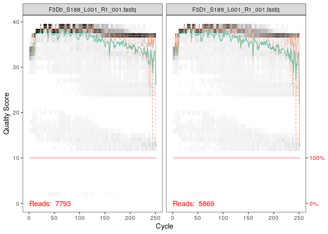

R Notebook
================

``` r
library(dada2)
```

    ## Loading required package: Rcpp

``` r
packageVersion("dada2")
```

    ## [1] '1.28.0'

``` r
path <- "~/MiSeq_SOP" # CHANGE ME to the directory containing the fastq files after unzipping.
list.files(path)
```

    ##  [1] "F3D0_S188_L001_R1_001.fastq"   "F3D0_S188_L001_R2_001.fastq"  
    ##  [3] "F3D1_S189_L001_R1_001.fastq"   "F3D1_S189_L001_R2_001.fastq"  
    ##  [5] "F3D141_S207_L001_R1_001.fastq" "F3D141_S207_L001_R2_001.fastq"
    ##  [7] "F3D142_S208_L001_R1_001.fastq" "F3D142_S208_L001_R2_001.fastq"
    ##  [9] "F3D143_S209_L001_R1_001.fastq" "F3D143_S209_L001_R2_001.fastq"
    ## [11] "F3D144_S210_L001_R1_001.fastq" "F3D144_S210_L001_R2_001.fastq"
    ## [13] "F3D145_S211_L001_R1_001.fastq" "F3D145_S211_L001_R2_001.fastq"
    ## [15] "F3D146_S212_L001_R1_001.fastq" "F3D146_S212_L001_R2_001.fastq"
    ## [17] "F3D147_S213_L001_R1_001.fastq" "F3D147_S213_L001_R2_001.fastq"
    ## [19] "F3D148_S214_L001_R1_001.fastq" "F3D148_S214_L001_R2_001.fastq"
    ## [21] "F3D149_S215_L001_R1_001.fastq" "F3D149_S215_L001_R2_001.fastq"
    ## [23] "F3D150_S216_L001_R1_001.fastq" "F3D150_S216_L001_R2_001.fastq"
    ## [25] "F3D2_S190_L001_R1_001.fastq"   "F3D2_S190_L001_R2_001.fastq"  
    ## [27] "F3D3_S191_L001_R1_001.fastq"   "F3D3_S191_L001_R2_001.fastq"  
    ## [29] "F3D5_S193_L001_R1_001.fastq"   "F3D5_S193_L001_R2_001.fastq"  
    ## [31] "F3D6_S194_L001_R1_001.fastq"   "F3D6_S194_L001_R2_001.fastq"  
    ## [33] "F3D7_S195_L001_R1_001.fastq"   "F3D7_S195_L001_R2_001.fastq"  
    ## [35] "F3D8_S196_L001_R1_001.fastq"   "F3D8_S196_L001_R2_001.fastq"  
    ## [37] "F3D9_S197_L001_R1_001.fastq"   "F3D9_S197_L001_R2_001.fastq"  
    ## [39] "filtered"                      "HMP_MOCK.v35.fasta"           
    ## [41] "Mock_S280_L001_R1_001.fastq"   "Mock_S280_L001_R2_001.fastq"  
    ## [43] "mouse.dpw.metadata"            "mouse.time.design"            
    ## [45] "stability.batch"               "stability.files"

``` r
# Forward and reverse fastq filenames have format: SAMPLENAME_R1_001.fastq and SAMPLENAME_R2_001.fastq
fnFs <- sort(list.files(path, pattern="_R1_001.fastq", full.names = TRUE))
fnRs <- sort(list.files(path, pattern="_R2_001.fastq", full.names = TRUE))
# Extract sample names, assuming filenames have format: SAMPLENAME_XXX.fastq
sample.names <- sapply(strsplit(basename(fnFs), "_"), `[`, 1)
```

``` r
plotQualityProfile(fnFs[1:2])
```

<!-- -->

``` r
# Forward and reverse fastq filenames have format: SAMPLENAME_R1_001.fastq and SAMPLENAME_R2_001.fastq
fnFs <- sort(list.files(path, pattern="_R1_001.fastq", full.names = TRUE))
fnRs <- sort(list.files(path, pattern="_R2_001.fastq", full.names = TRUE))
# Extract sample names, assuming filenames have format: SAMPLENAME_XXX.fastq
sample.names <- sapply(strsplit(basename(fnFs), "_"), `[`, 1)
```

``` r
# Place filtered files in filtered/ subdirectory
filtFs <- file.path(path, "filtered", paste0(sample.names, "_F_filt.fastq.gz"))
filtRs <- file.path(path, "filtered", paste0(sample.names, "_R_filt.fastq.gz"))
names(filtFs) <- sample.names
names(filtRs) <- sample.names
```

``` r
out <- filterAndTrim(fnFs, filtFs, fnRs, filtRs, truncLen=c(240,160),
              maxN=0, maxEE=c(2,2), truncQ=2, rm.phix=TRUE,
              compress=TRUE, multithread=FALSE) # On Windows set multithread=FALSE
head(out)
```

    ##                               reads.in reads.out
    ## F3D0_S188_L001_R1_001.fastq       7793      7113
    ## F3D1_S189_L001_R1_001.fastq       5869      5299
    ## F3D141_S207_L001_R1_001.fastq     5958      5463
    ## F3D142_S208_L001_R1_001.fastq     3183      2914
    ## F3D143_S209_L001_R1_001.fastq     3178      2941
    ## F3D144_S210_L001_R1_001.fastq     4827      4312

``` r
errF <- learnErrors(filtFs, multithread=FALSE)
```

    ## 33514080 total bases in 139642 reads from 20 samples will be used for learning the error rates.

``` r
errR <- learnErrors(filtRs, multithread=FALSE)
```

    ## 22342720 total bases in 139642 reads from 20 samples will be used for learning the error rates.

``` r
plotErrors(errF, nominalQ=TRUE)
```

    ## Warning: Transformation introduced infinite values in continuous y-axis
    ## Transformation introduced infinite values in continuous y-axis

<!-- -->

``` r
errR <- learnErrors(filtRs, multithread=FALSE)
```

    ## 22342720 total bases in 139642 reads from 20 samples will be used for learning the error rates.

``` r
dadaFs <- dada(filtFs, err=errF, multithread=FALSE)
```

    ## Sample 1 - 7113 reads in 1979 unique sequences.
    ## Sample 2 - 5299 reads in 1639 unique sequences.
    ## Sample 3 - 5463 reads in 1477 unique sequences.
    ## Sample 4 - 2914 reads in 904 unique sequences.
    ## Sample 5 - 2941 reads in 939 unique sequences.
    ## Sample 6 - 4312 reads in 1267 unique sequences.
    ## Sample 7 - 6741 reads in 1756 unique sequences.
    ## Sample 8 - 4560 reads in 1438 unique sequences.
    ## Sample 9 - 15637 reads in 3590 unique sequences.
    ## Sample 10 - 11413 reads in 2762 unique sequences.
    ## Sample 11 - 12017 reads in 3021 unique sequences.
    ## Sample 12 - 5032 reads in 1566 unique sequences.
    ## Sample 13 - 18075 reads in 3707 unique sequences.
    ## Sample 14 - 6250 reads in 1479 unique sequences.
    ## Sample 15 - 4052 reads in 1195 unique sequences.
    ## Sample 16 - 7369 reads in 1832 unique sequences.
    ## Sample 17 - 4765 reads in 1183 unique sequences.
    ## Sample 18 - 4871 reads in 1382 unique sequences.
    ## Sample 19 - 6504 reads in 1709 unique sequences.
    ## Sample 20 - 4314 reads in 897 unique sequences.

``` r
dadaRs <- dada(filtRs, err=errR, multithread=FALSE)
```

    ## Sample 1 - 7113 reads in 1660 unique sequences.
    ## Sample 2 - 5299 reads in 1349 unique sequences.
    ## Sample 3 - 5463 reads in 1335 unique sequences.
    ## Sample 4 - 2914 reads in 853 unique sequences.
    ## Sample 5 - 2941 reads in 880 unique sequences.
    ## Sample 6 - 4312 reads in 1286 unique sequences.
    ## Sample 7 - 6741 reads in 1803 unique sequences.
    ## Sample 8 - 4560 reads in 1265 unique sequences.
    ## Sample 9 - 15637 reads in 3414 unique sequences.
    ## Sample 10 - 11413 reads in 2522 unique sequences.
    ## Sample 11 - 12017 reads in 2771 unique sequences.
    ## Sample 12 - 5032 reads in 1415 unique sequences.
    ## Sample 13 - 18075 reads in 3290 unique sequences.
    ## Sample 14 - 6250 reads in 1390 unique sequences.
    ## Sample 15 - 4052 reads in 1134 unique sequences.
    ## Sample 16 - 7369 reads in 1635 unique sequences.
    ## Sample 17 - 4765 reads in 1084 unique sequences.
    ## Sample 18 - 4871 reads in 1161 unique sequences.
    ## Sample 19 - 6504 reads in 1502 unique sequences.
    ## Sample 20 - 4314 reads in 732 unique sequences.
